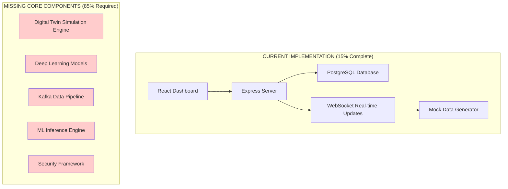
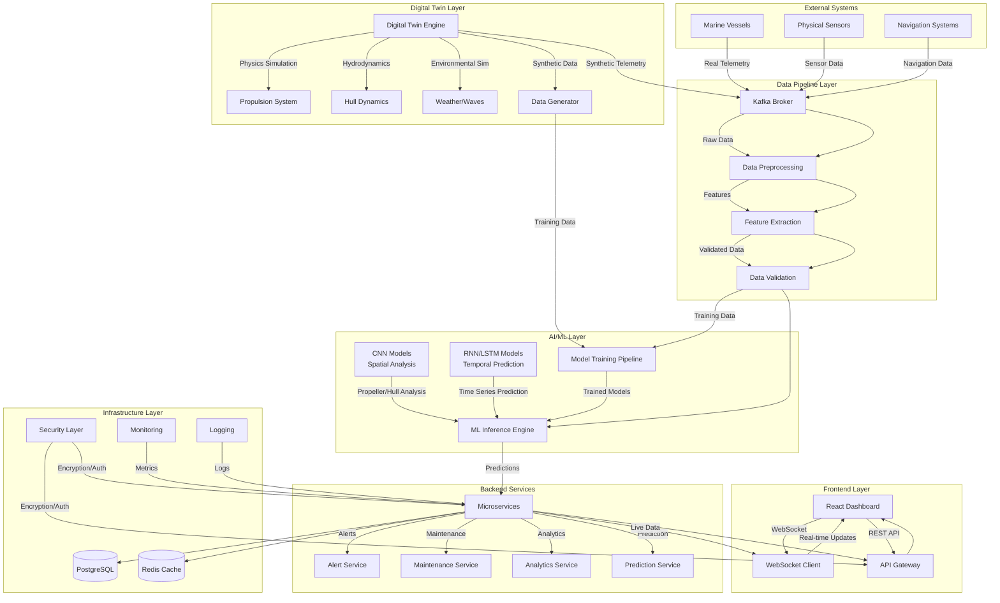
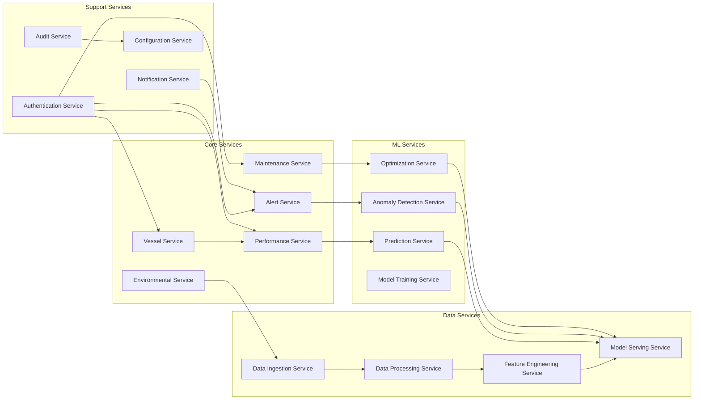
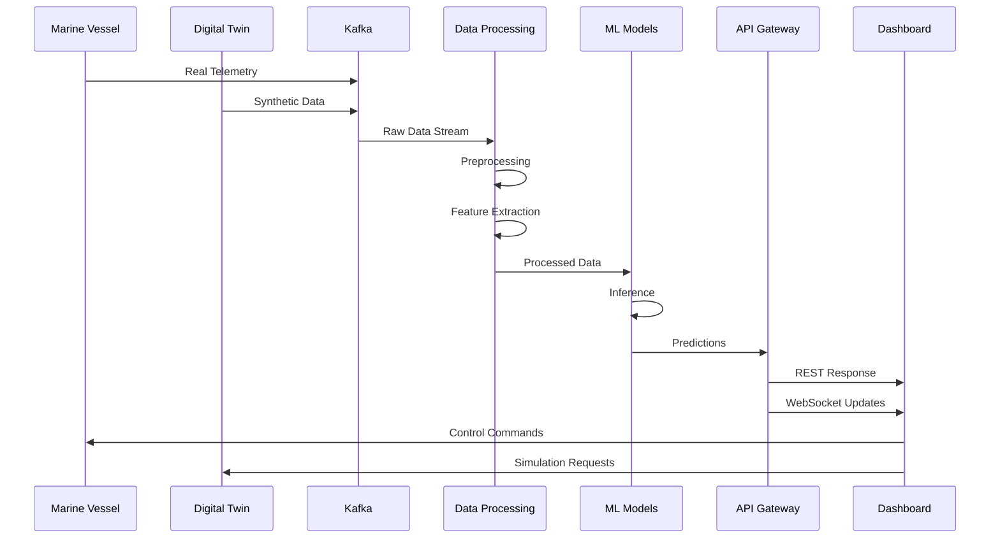
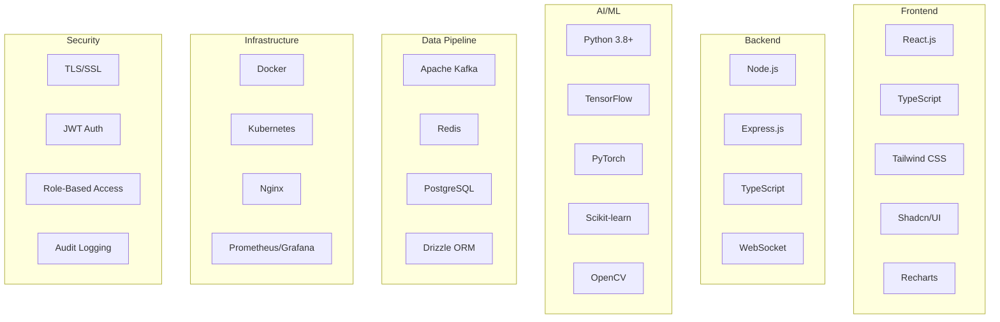
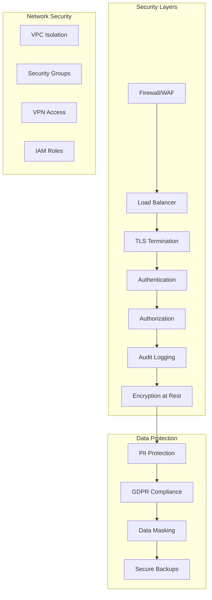
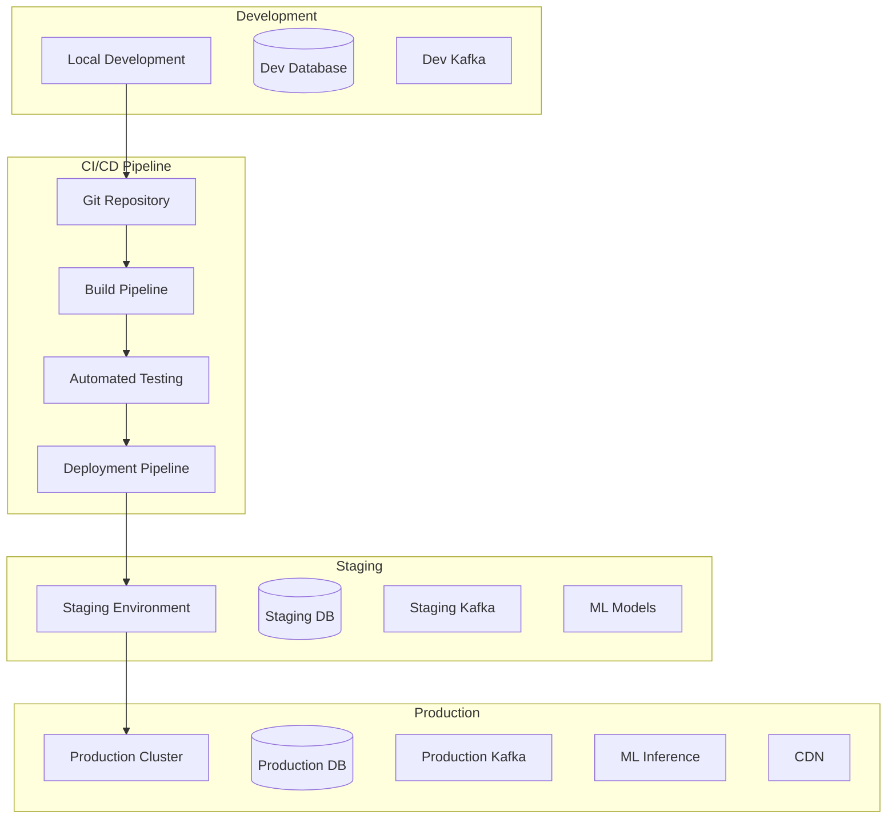

# Marine Vessel Operations - System Architecture Diagram

## Current Implementation vs PRD Requirements

## Complete Target Architecture

## Microservices Architecture

## Data Flow Architecture

## Technology Stack

## Security Architecture

## Deployment Architecture

